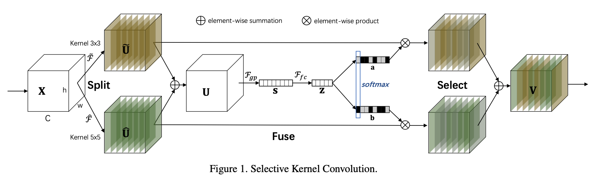

[TensorFlow 2] Selective Kernel Networks
=====

## Concept
<div align="center">
    
  <p>The concept of SKNet [1].</p>
</div>

## Performance

|Indicator|Value|
|:---|:---:|
|Accuracy|0.99160|
|Precision|0.99173|
|Recall|0.99154|
|F1-Score|0.99161|

```
Confusion Matrix
[[ 977    0    0    0    0    0    2    0    0    1]
 [   0 1133    1    1    0    0    0    0    0    0]
 [   1    1 1024    0    0    0    1    4    1    0]
 [   0    0    1 1000    0    5    0    1    0    3]
 [   0    0    2    0  964    0    1    2    1   12]
 [   1    0    0    4    0  885    1    0    0    1]
 [   1    3    0    0    0    1  953    0    0    0]
 [   0    7    6    0    2    0    0 1009    0    4]
 [   1    0    1    1    0    1    0    0  965    5]
 [   0    0    0    0    3    0    0    0    0 1006]]
Class-0 | Precision: 0.99592, Recall: 0.99694, F1-Score: 0.99643
Class-1 | Precision: 0.99038, Recall: 0.99824, F1-Score: 0.99430
Class-2 | Precision: 0.98937, Recall: 0.99225, F1-Score: 0.99081
Class-3 | Precision: 0.99404, Recall: 0.99010, F1-Score: 0.99206
Class-4 | Precision: 0.99484, Recall: 0.98167, F1-Score: 0.98821
Class-5 | Precision: 0.99215, Recall: 0.99215, F1-Score: 0.99215
Class-6 | Precision: 0.99478, Recall: 0.99478, F1-Score: 0.99478
Class-7 | Precision: 0.99311, Recall: 0.98152, F1-Score: 0.98728
Class-8 | Precision: 0.99793, Recall: 0.99076, F1-Score: 0.99433
Class-9 | Precision: 0.97481, Recall: 0.99703, F1-Score: 0.98579

Total | Accuracy: 0.99160, Precision: 0.99173, Recall: 0.99154, F1-Score: 0.99161
```

## Requirements
* Python 3.7.6  
* Tensorflow 2.1.0  
* Numpy 1.18.1  
* Matplotlib 3.1.3  

## Reference
[1] Xiang Li et al. (2019). <a href="https://arxiv.org/abs/1903.06586">Selective Kernel Networks</a>. arXiv preprint arXiv:1903.06586.
